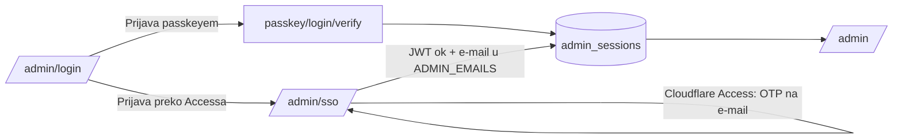
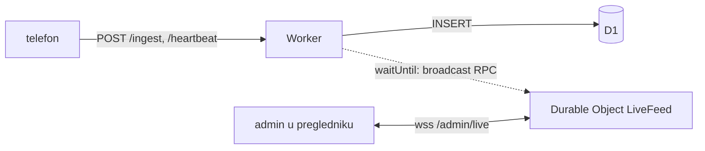

# Admin

`https://bank-push-gateway.domovina.ai/admin` — pregled sirovih događaja,
uređaja (heartbeat, baterija, red na telefonu) i konflikata seq.

## Odluke (6.10.2026.)

- **Hono JSX na serveru, u istom Workeru.** Nema build koraka ni klijentskog
  frameworka. Isti Hono i ista DOMOVINA paleta kao `pay.domovina.ai` admin, ali
  stranice su TSX komponente umjesto HTML-a u template stringovima.
- **Razlog za JSX:** tekst obavijesti (ime uplatitelja, opis plaćanja) piše
  bilo tko tko uplati novac. JSX escapea svaki `{izraz}`; `raw()` se koristi
  samo za konstantni logo. Test `admin.test.ts` → „escapea tekst obavijesti".
- **Dva puta ulaska, jedna sesija:**
  1. **Passkey** (WebAuthn, `@simplewebauthn/server`, isti obrazac kao
     `crosulja-hr`). Discoverable ključ, `userVerification: required`.
  2. **Cloudflare Access** na `/admin/sso` (identity provider: One-time PIN na
     e-mail). Worker dodatno provjerava JWT (potpis, issuer, AUD).
- **Prvi passkey** se upisuje nakon ulaska preko Accessa. Access je ujedno
  oporavak ako se izgube svi passkeyi — nema break-glass tokena.

## Tok

## Live prikaz (WebSocket)

- **Jedan Durable Object** (`LiveFeed`, `idFromName("admin")`) drži sve otvorene
  admin veze. Bez njega `/ingest` i WebSocket završe u različitim instancama
  Workera i ne mogu razgovarati.
- **WebSocket Hibernation API:** DO ne drži memoriju ni naplatu dok veze
  miruju; budi se samo na broadcast. Klijentov `ping` svakih 30 s odgovara se
  bez buđenja (`setWebSocketAutoResponse`).
- **Broadcast ide nakon odgovora telefonu** (`ctx.waitUntil`): greška u live
  prikazu ne utječe na primitak, događaj je već u D1.
- Šalje se **sažetak** (id, uređaj, paket, naslov, tekst, kašnjenje), ne cijelo
  sirovo tijelo; cijelo je na `/admin/events/:id`.
- Duplikat (`200 duplicate`) ne šalje poruku.
- **Auth:** upgrade zahtjev nosi isti kolačić sesije; Worker provjerava
  sesiju **i** `Origin` (WebSocket nema CORS, pa bez toga tuđa stranica može
  otvoriti vezu s tvojim kolačićem — CSWSH). Uz vezu se pamti istek sesije;
  istekla veza se zatvara kodom 4401 i stranica se ponovno učita.
- **Klijent** (`/admin/static/live.js`) gradi retke samo preko `textContent`.
  Na stranici Uređaji svaka poruka znači ponovno učitavanje (debounce 0,8 s).
  Prekid veze → ponovno spajanje s eksponencijalnim čekanjem do 30 s.
- Live radi samo na prvoj stranici liste i poštuje filter uređaja/paketa.

## Sigurnost

| Mjera | Gdje |
|---|---|
| Sesija: 32 nasumična bajta u kolačiću `__Host-bpg_admin` (HttpOnly, Secure, SameSite=Lax, 12 h); u D1 samo sha-256 | `src/admin/session.ts` |
| Pri svakom zahtjevu provjera da je e-mail još u `ADMIN_EMAILS` | `getSession` |
| CSRF: svaki POST mora imati `Origin` jednak originu admina | `src/admin/app.tsx` |
| WebAuthn izazov jednokratan, 5 min, vezan uz svrhu (login/register) i e-mail | `consumeChallenge` |
| `rpID` = hostname zahtjeva: passkey s localhosta ne otvara produkciju | `src/admin/passkey.ts` |
| CSP `script-src 'self'` (bez inline skripti), `connect-src 'self' wss://<host>`, `frame-ancestors 'none'`, `no-store` | middleware |
| `Referrer-Policy: same-origin` — ne `no-referrer`, jer tada preglednik na `<form>` POST šalje `Origin: null` | middleware |
| WebSocket `/admin/live`: sesija + `Origin` | `src/admin/app.tsx` |
| Otvoreno preusmjeravanje: `next` samo `/admin…` | `safeNext` |
| Access JWT: RS256, issuer `https://<team>.cloudflareaccess.com`, AUD | `src/admin/access.ts` |

## Konfiguracija

`worker/wrangler.jsonc` → `vars` (nisu tajne):

| Varijabla | Vrijednost |
|---|---|
| `ADMIN_EMAILS` | e-mailovi koji smiju u admin |
| `ACCESS_TEAM_DOMAIN` | `domovina.cloudflareaccess.com` |
| `ACCESS_AUD` | AUD Access aplikacije „bank-push-gateway admin (sso)" |

Access aplikacija (Zero Trust → Access → Applications):
`bank-push-gateway admin (sso)`, domena `bank-push-gateway.domovina.ai/admin/sso`,
politika „bank-push-gateway admini" (include: e-mailovi), IdP One-time PIN,
sesija 24 h. Oduzimanje pristupa: makni e-mail iz `ADMIN_EMAILS` (djeluje
odmah, i na postojeće sesije) i iz Access politike.

## Lokalno

`wrangler dev` radi i za admin; passkey radi na `http://localhost` (WebAuthn
dopušta localhost). Access lokalno ne radi, pa je za prvi lokalni passkey
potrebna sesija upisana ručno u lokalni D1 (vidi `test/admin.test.ts` →
`createSession`).
